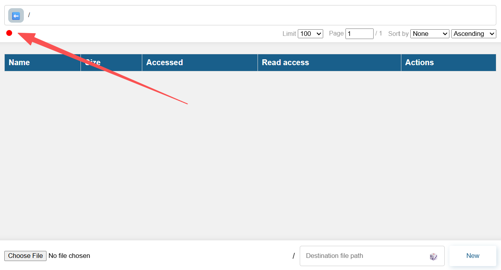

# Connect to LFSS

## WebUI and JavaScript API
A simple web-based file manager is provided in the package.  
The web app can be accessed at the `/.panel/` path after starting the LFSS server.

*e.g.*
if your server is running at `http://localhost:8000`,
you can open the panel at `http://localhost:8000/.panel/`.

Or, you can open a static web server at the `/frontend` directory ([source](https://github.com/MenxLi/lfss/tree/main/frontend)).

> The panel is pretty basic at the moment, and is not planned to be a full-featured file manager. 
If you want a more advanced file manager, please consider building your own with the APIs. 

Alongside the web server, a JavaScript API client is also provided in the `frontend` directory. 
Simply include the [`api.js`](https://github.com/MenxLi/lfss/blob/main/frontend/api.js) file in your project to easily interact with the LFSS server.

:::tip
If you see a blank page when opening the panel, or you want to change the server endpoint, 
please click on this button to configure the endpoint and token.

<!--  -->

:::

## Python Tools

To install python CLI tools without dependencies (to avoid conflicts with your existing packages):
```sh
pip install lfss
```

Then set the `LFSS_ENDPOINT`, `LFSS_TOKEN` environment variables, 
then you can use the following commands:
```sh
# Check current user information
lfss whoami

# Query a path
lfss i remote/file[/or_dir/]

# List a specified path, 
# with pagination and sorting
lfss ls remote/dir/ --offset 0 --limit 100 --order access_time 

# Upload a file
lfss up local/file.txt remote/file.txt

# Upload a directory, note the ending slashes
lfss up local/dir/ remote/dir/

# Download a file
lfss down remote/file.txt local/file.txt

# Download a directory, with 8 concurrent jobs
# Overwrite existing files
lfss down remote/dir/ local/dir/ -j 8 --conflict overwrite  
```

More commands can be found using `lfss --help`.


## Python API
The CLI is essentially a thin wrapper around the Python API. 
You can also use the Python API directly in your project. 
For example, to stream download the first file in your root directory:
```python
from lfss.api import Client

c = Client()

user = c.whoami()

# make sure there is at least one file in your root directory
assert c.count_files(f"{user.username}/") > 0

file = c.list_files(f"{user.username}/")[0]

# use the original filename
with open(file.name(), "wb") as f:
    for chunk in c.get_stream(file.url, chunk_size=8192):
        f.write(chunk)
```
More comments can be found at the implementation of the [Client class](https://github.com/MenxLi/lfss/blob/main/lfss/api/connector.py).

