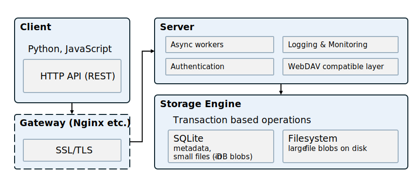

# Lite File Storage Service (LFSS)

A lightweight and high-performance object storage service, 
using sqlite and filesystem as the backend storage.

**Highlights:**

- User storage limit and multi-level access control.
- Pagination and sorted file listing for vast number of files.  
- Support range requests, so you can stream large files / resume download.
- User-friendly web panel for management.
- WebDAV compatible ([NOTE](./webdav.md)).